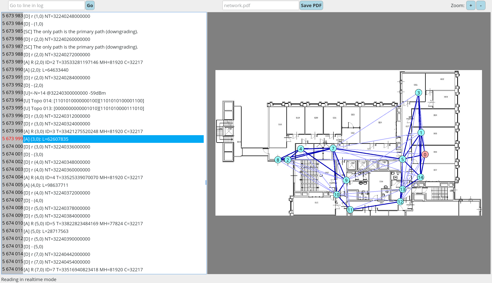

# TDMH Visualizer

This program helps visualize logs. A graph with the nodes put on the background image is displayed.

## Compiling
The project has been created with QT Creator.

In alternative to that in the repository is a .sh that generates the makefile using qmake. QT 5.12.6 is required.

If libs are not detected or error on parse, make sure that qmake is using the right qt installation:

`qtchooser -install qt5.12.6 <pathtoqmake>`

e.g. `qtchooser -install qt5.12.6 /opt/Qt/5.12.6/gcc_64/bin/qmake`

then `export Q_SELECT=qt5.12.6`

Run .sh with `debug` argument to generate a debug build

## Configuration and Execution

Command line arguments:
* The program accepts as first argument the path to the configuration file. A commented example configuration file can be found [here](https://github.com/luca-conterio/tdmh_visualizer/blob/master/logconfig.txt).
* As a second parameter a log file can be specified, otherwise the one found in the configuration file is used.
* The third optional parameter is the log visualization mode. Again, if it is not specified, the one found in the configuration file is used.  
The visualizer can operate in three different modes: 
    - `BATCH` reads and processes a file
    - `RTIME` reads a file and then remains active scanning for new lines in real time
    - `STAT` produces links availabilities for the given log file
    
Summarizing, one can execute the TDMH log visualizer as: `./executable <config_file> [<log_file> [<mode>]]` 
 
If `STAT` visualization mode is selected then the availabilities (timed and untimed) will be shown on the text window. Selecting a line from one of the two will display on the graph the arcs for each non-zero availability link.
A line with little space between dashes means closer to `100%`, while a line with more space between dashes means closer to `0%`.

If `BATCHFIRST` is specified in the configuration file, the program processes the entire log and then updates the GUI.   
If not specified, it updates the GUI every time the bottom of the scroll bar is reached, so that the log can be inspected while it is being loaded.

Finally, the configuration file also allows to specify the image usage as a background for the network graph, as well as the coordinates of all the network nodes. This is useful to render the network graph for example on top of the plant of the environment in which the network is deployed.

## Usage
On the left side of the window the log file is shown: click on a row to show the network graph at that specific point in time. Dark blue lines represent strong links, while weak ones are identified by light blue lines.

The application toolbar allows to jump to a specific line number (useful for very long log files), to save the network graph image to PDF and to zoom in and out the graph itself.

Keyboard shortcuts:
* `Ctrl++` and `Ctrl+-` can be used to zoom the network graph image. Otherwise, a mouse scroll while keeping `Ctrl` pressed will produce the same effect.
* `Ctrl+f` sets the focus on the log line search text box. After typing the desired line number, `Enter` can be used to trigger the search.
* `Ctrl+s` sets the focus on the network image save text box. After typing the desired file name, `Enter` can be used to save the file.

